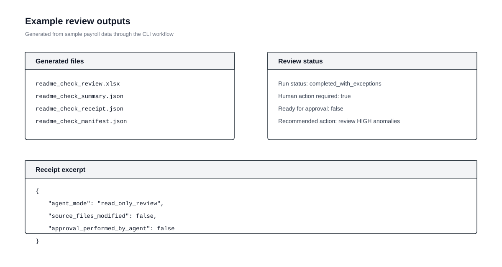
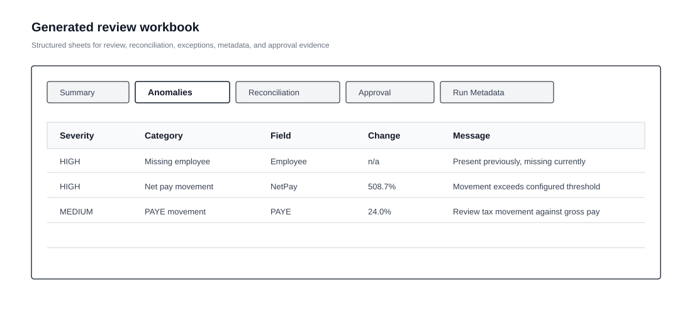
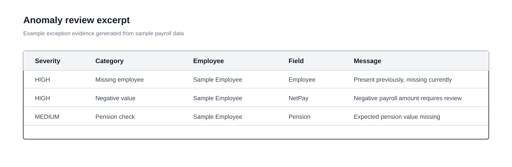

# OpenClaw Payroll Review Agent

[](https://github.com/DieArchitekt/openclaw-payroll-review-agent/actions/workflows/ci.yml)


Controlled payroll review automation for OpenClaw: deterministic checks, local
evidence packs, and auditable handoff for finance review.



Prototype submission for the DataVita OpenClaw Challenge.


## Why this matters

Payroll review is recurring, sensitive, and operationally exposed. OpenClaw
makes the workflow more consistent without moving decision authority into the
agent.


## Quick demo

After setup, run the review against included sample data:

```bash
python -m processors.payroll_review_cli sample_data/payroll_controls_current.csv sample_data/payroll_controls_previous.csv --output-dir outputs/reviews/readme_demo --output-prefix readme_demo --prepared-by "README Demo"
```

First-run outputs:

```text
outputs/reviews/readme_demo/readme_demo_review.xlsx
outputs/reviews/readme_demo/readme_demo_summary.json
outputs/reviews/readme_demo/readme_demo_receipt.json
outputs/reviews/readme_demo/readme_demo_manifest.json
```


## Why OpenClaw

Payroll review is a constrained workflow: file arrival, approved command
execution, structured evidence, and defined operational boundaries.

The repository exposes a constrained command surface for OpenClaw automation.


## Problem

Finance teams compare current payroll against previous runs, explain movements,
check exceptions, and retain approval evidence.

The work is often manual. Inputs can be messy. Headers vary between providers.
Evidence can be scattered.

The objective is controlled review automation: faster evidence preparation
without weakening governance.


## System

The Payroll Review Agent ingests current and previous payroll files, recognises
fields, reconciles rows, detects exceptions, and generates a local review pack.

| It is | It is not |
|---|---|
| An OpenClaw-operated review workflow | A payment release tool |
| A reconciliation and anomaly engine | A finance decision-maker |
| A local evidence pack generator | A system that sends payroll data externally |

The Streamlit app and CLI both use:

```text
run_payroll_review(current_file, previous_file, variance_threshold)
```


## Agent workflow


OpenClaw operates around the review workflow. It detects files, runs the
approved wrapper, reads the receipt and manifest, and reports the result.

Runtime policy: `openclaw/runtime_policy.json`.


## Design goals

- Human sign-off remains part of the process.
- Source payroll files are immutable.
- The agent prepares evidence, not decisions.
- Outputs are reproducible and auditable.
- Sensitive identifiers are minimised where possible.
- The workflow fails closed on unsafe or ambiguous inputs.
- Modules stay small, explicit, and testable.


## Payroll controls

The controls are review prompts, not final payroll judgement.

| Area | Examples |
|---|---|
| Employee controls | New or missing employees, leavers still paid, starters without approval, duplicate or similar names |
| Financial controls | High net pay, negative values, gross pay with zero tax or NI, bonus/overtime/commission movement |
| Compliance-oriented checks | Missing pension values, unusually low PAYE or NI against gross pay |
| Reconciliation checks | Net pay movement, employer cost movement, BACS mismatch, missing department or cost centre |

Client-specific payroll rules would need configuration before live use.


## Example review outputs

The workflow writes a workbook, summary, receipt, and manifest.





Receipt excerpt:

```json
{
  "agent_mode": "read_only_review",
  "human_action_required": true,
  "run_status": "completed_with_exceptions",
  "source_files_modified": false,
  "external_messages_sent": false,
  "approval_performed_by_agent": false
}
```

Manifest excerpt:

```json
{
  "current_file_sha256": "44fe5ef5dae18cb71f5416b0e046ed97081a1e76bb5d12b888946db8d0ecc186",
  "previous_file_sha256": "51dbe404b5d9e0f9c39a9bd73abb81199f9d256f67f62add88012af52b5239a9",
  "review_workbook_sha256": "62d8447fe72e7aa545ff88055324fa53f8a7fdaed209a5e53362175548df56f9"
}
```


## Operating boundary

| Risk | Control |
|---|---|
| Agent performs approval | Approval actions are outside agent authority |
| Source data changes | Incoming payroll files are treated as immutable |
| Evidence is disputed | Manifests include file hashes |
| Sensitive identifiers leak into summaries | Agent-facing outputs minimise sensitive values |
| Payroll data contains instructions | Text is treated as data and can be flagged |

Approval states are represented in the generated review evidence.

| Stage | Meaning |
|---|---|
| Prepared | Review pack generated |
| Reviewed | Reviewer has inspected the evidence |
| Queries raised | Exceptions require follow-up |
| Approved / Rejected | Human decision recorded |
| Exported for payment | Downstream finance process, outside agent authority |

---

## Repository architecture

| Area | Purpose |
|---|---|
| `app/` | Streamlit review interface |
| `gui/` | Shared UI and workbook styling |
| `processors/payroll_processor_v1/` | Extraction and field recognition |
| `processors/reconciliation_engine_v1/` | Current vs previous payroll comparison |
| `processors/anomaly_detector_v1/` | Payroll control checks |
| `processors/report_generator_v1/` | Excel review pack generation |
| `processors/approval_workflow_v1/` | Approval status model |
| `processors/agent_controls_v1/` | Receipt, redaction, and review gate controls |
| `processors/openclaw_runtime_v1/` | Runtime policy and environment validation |
| `openclaw/runtime_policy.json` | Machine-readable agent boundary |
| `scripts/` | Wrapper scripts for OpenClaw and local automation |


## Run locally

Install dependencies:

```bash
python -m venv .venv
source .venv/bin/activate
python -m pip install --upgrade pip
python -m pip install -r requirements-dev.txt
```

On Windows, activate with `.\.venv\Scripts\Activate.ps1`.

Run the Streamlit app:

```bash
python -m streamlit run app/main.py
```

Run the OpenClaw wrapper with sample files:

```powershell
powershell -ExecutionPolicy Bypass -File .\scripts\run_openclaw_payroll_review.ps1 -Current ".\sample_data\payroll_controls_current.csv" -Previous ".\sample_data\payroll_controls_previous.csv" -OutputFolder ".\outputs\reviews\openclaw_demo" -OutputPrefix "openclaw_demo" -PreparedBy "OpenClaw"
```

Validate runtime wiring:

```bash
python -m processors.openclaw_runtime_v1 check-env
python -m processors.openclaw_runtime_v1 check-outputs outputs/reviews/readme_demo readme_demo
```


## Testing

```bash
python -m black --check app gui processors tests
python -m pytest -q
python -m compileall -q app gui processors tests
```

GitHub Actions runs formatting, tests, and a CLI smoke test using sample data.


## Business value

The value is operational: less repetitive checking, more consistent evidence,
clearer exception visibility, and a cleaner review handoff.

A fuller product could add configurable control packs, client-specific mapping,
role-based review access, audit retention, payroll provider connectors, and
stronger BACS reconciliation.


## Judging criteria

| Criterion | How this submission addresses it |
|---|---|
| Originality | Applies OpenClaw to a constrained finance control |
| Technical thinking | Uses field mapping, reconciliation, anomaly rules, workbook generation, receipts, manifests, CLI tooling, and runtime validation |
| Business value | Targets a recurring payroll review process with clear operational risk |
| Security and resilience | Uses local outputs, immutable source files, blocked actions, redaction, hashes, and fail-closed behaviour |
| Communication | Provides sample data, run commands, diagrams, output examples, and explicit limitations |


## Limitations

- Prototype only; not production payroll approval software.
- Sample data only; real payroll data should not be committed.
- Payroll rules need client-specific configuration before live use.
- OpenClaw runtime permissions must be configured outside this repository.
- Human review remains required before any payroll decision.


## Repository structure

```text
.github/
app/
docs/
gui/
incoming_payroll/
openclaw/
outputs/
processors/
sample_data/
scripts/
tests/
```
