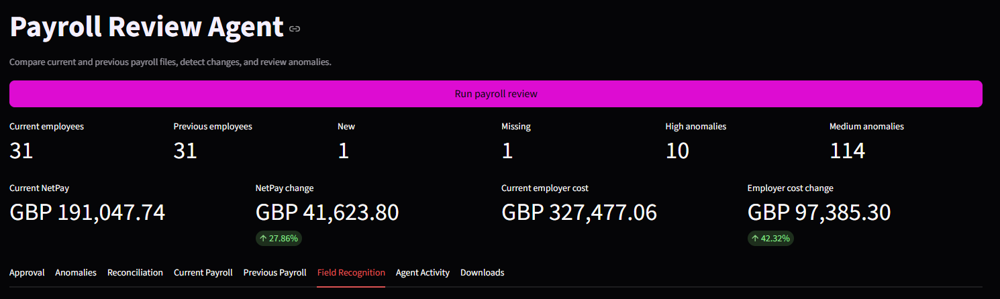
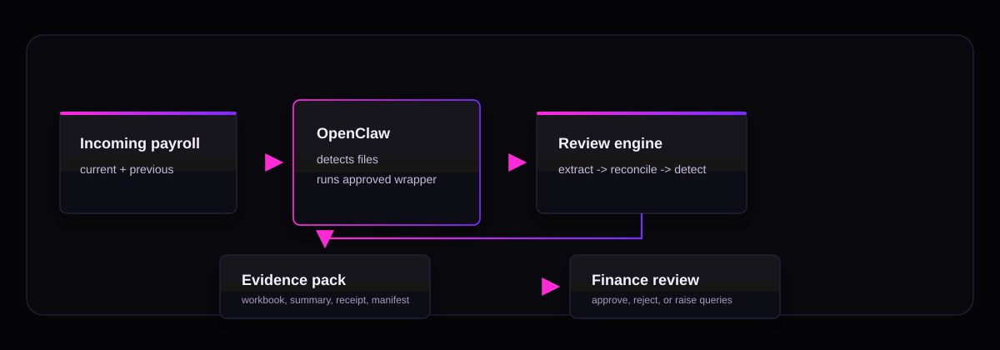
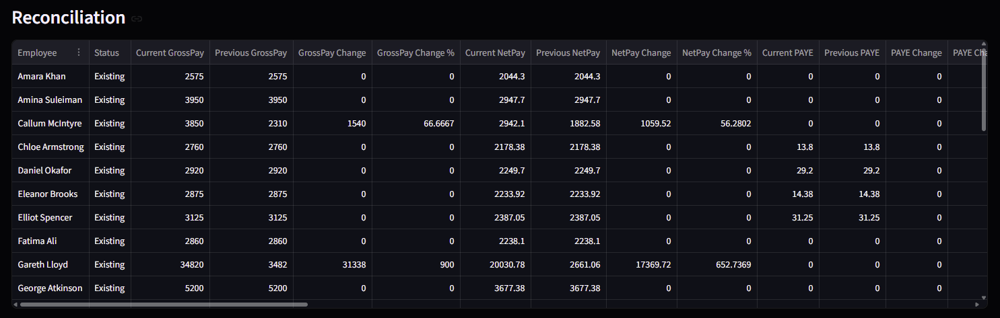
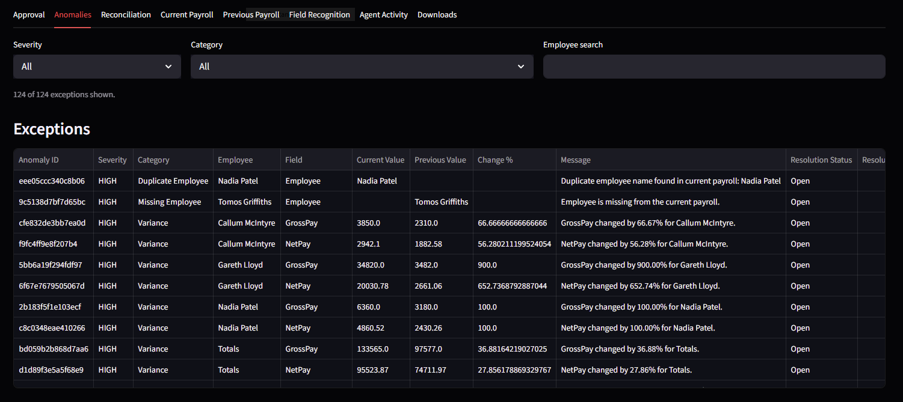

# OpenClaw Payroll Review Agent

[](https://github.com/DieArchitekt/openclaw-payroll-review-agent/actions/workflows/ci.yml)


## *Deterministic automation for payroll oversight.*




## What this is
A controlled OpenClaw workflow for payroll reconciliation, exception detection, and auditable review evidence.


## How this works
OpenClaw detects payroll inputs, runs a constrained review workflow, generates structured evidence and control outputs, and returns the results for human finance review.


## Why build this

Payroll review is repetitive, time-sensitive, and operationally risky, yet still heavily dependent on manual reconciliation and fragmented evidence gathering.


## Why OpenClaw

Payroll oversight is a constrained, evidence-driven workflow that suits deterministic automation, controlled execution, and explicit operational boundaries.


## Automation Model

The scope is intentionally narrow. The agent performs deterministic tasks inside a controlled workflow and within explicit operational boundaries.

The workflow produces measurable outputs rather than subjective responses: reconciliation results, anomaly reports, manifests, receipts, and review workbooks.

The design does not rely on prompting to behave. It relies on constrained tooling, runtime policy, explicit permissions, and reproducible workflows.


## How to Run

Install dependencies:

```bash
python -m venv .venv
source .venv/bin/activate
python -m pip install --upgrade pip
python -m pip install -r requirements-dev.txt
```

On Windows, activate with `.\.venv\Scripts\Activate.ps1`.

Run the OpenClaw workflow wrapper:

```powershell
powershell -ExecutionPolicy Bypass -File .\scripts\run_openclaw_payroll_review.ps1 -IncomingRoot ".\incoming_payroll" -OutputFolder ".\outputs\reviews\judge_run" -OutputPrefix "judge_run" -PreparedBy "OpenClaw"
```

Or run the full local verifier:

```powershell
.\scripts\verify_openclaw_workflow.ps1
```

The prepared OpenClaw instruction lives at `openclaw/agent_instruction.md`.

The repository includes the competition input pair:

```text
incoming_payroll/current.pdf
incoming_payroll/previous.pdf
```

Validate runtime wiring:

```bash
python -m processors.openclaw_runtime_v1 check-env
python -m processors.openclaw_runtime_v1 check-outputs outputs/reviews/judge_run judge_run
```

For human visual inspection only, the Streamlit app can also be launched:

```bash
python -m streamlit run app/main.py
```


## Problem

Finance teams compare current payroll against previous runs, explain movements,
check exceptions, and retain approval evidence.

The work is manual. Inputs are messy. Headers vary between providers.
Evidence can be scattered.

The objective is controlled review automation: faster evidence preparation
without weakening governance.


## System

The Payroll Review Agent ingests current and previous payroll files, recognises
fields, reconciles rows, detects exceptions, and generates a local review pack.

| It is | It is not |
|---|---|
| An OpenClaw-operated review workflow | A payment release tool |
| A reconciliation and anomaly engine | A finance decision-maker |
| A local evidence pack generator | A system that sends payroll data externally |


## Agent workflow



The workflow is executed through the OpenClaw command path. The Streamlit interface is available for human visual inspection, but the project is designed around automation.

OpenClaw is the workflow layer: it runs the approved wrapper, then reports from the generated receipt and manifest.

Runtime policy: `openclaw/runtime_policy.json`.


## Design goals

- Human sign-off remains part of the process.
- Source payroll files are immutable.
- The agent prepares evidence, not decisions.
- Outputs are reproducible and auditable.
- Sensitive identifiers are minimised where possible.
- The workflow fails closed on unsafe or ambiguous inputs.
- Modules stay small, explicit, and testable.


## Payroll controls

The control checks are designed as review prompts rather than final payroll
judgement.

| Area | Examples |
|---|---|
| Employee controls | New or missing employees, leavers still paid, starters without approval, duplicate or similar names |
| Financial controls | High net pay, negative values, gross pay with zero tax or NI, bonus/overtime/commission movement |
| Compliance-oriented checks | Missing pension values, unusually low PAYE or NI against gross pay |
| Reconciliation checks | Net pay movement, employer cost movement, BACS mismatch, missing department or cost centre |


## Example review outputs

The workflow writes a workbook, summary, receipt, and manifest.





Receipt excerpt:

```json
{
  "agent_mode": "read_only_review",
  "human_action_required": true,
  "run_status": "completed_with_exceptions",
  "source_files_modified": false,
  "external_messages_sent": false,
  "approval_performed_by_agent": false
}
```

Manifest excerpt:

```json
{
  "current_file_sha256": "44fe5ef5dae18cb71f5416b0e046ed97081a1e76bb5d12b888946db8d0ecc186",
  "previous_file_sha256": "51dbe404b5d9e0f9c39a9bd73abb81199f9d256f67f62add88012af52b5239a9",
  "review_workbook_sha256": "62d8447fe72e7aa545ff88055324fa53f8a7fdaed209a5e53362175548df56f9"
}
```


## Operating boundary

| Risk | Control |
|---|---|
| Agent performs approval | Approval actions are outside agent authority |
| Source data changes | Incoming payroll files are treated as immutable |
| Evidence is disputed | Manifests include file hashes |
| Sensitive identifiers leak into summaries | Agent-facing outputs minimise sensitive values |
| Payroll data contains instructions | Text is treated as data and can be flagged |

Approval states are represented in the generated review evidence.

| Stage | Meaning |
|---|---|
| Prepared | Review pack generated |
| Reviewed | Reviewer has inspected the evidence |
| Queries raised | Exceptions require follow-up |
| Approved / Rejected | Human decision recorded |
| Exported for payment | Downstream finance process, outside agent authority |


## Repository architecture

| Area | Purpose |
|---|---|
| `app/` | Streamlit review interface |
| `gui/` | Shared UI and workbook styling |
| `processors/payroll_processor_v1/` | Extraction and field recognition |
| `processors/reconciliation_engine_v1/` | Current vs previous payroll comparison |
| `processors/anomaly_detector_v1/` | Payroll control checks |
| `processors/report_generator_v1/` | Excel review pack generation |
| `processors/approval_workflow_v1/` | Approval status model |
| `processors/agent_controls_v1/` | Receipt, redaction, and review gate controls |
| `processors/openclaw_runtime_v1/` | Runtime policy and environment validation |
| `openclaw/runtime_policy.json` | Machine-readable agent boundary |
| `openclaw/agent_instruction.md` | Prepared instruction for OpenClaw |
| `scripts/` | Wrapper scripts for OpenClaw and local automation |


## Testing

```bash
python -m black --check app gui processors tests
python -m pytest -q
python -m compileall -q app gui processors tests
```

GitHub Actions runs formatting, tests, and a CLI test using the incoming payroll files.


## Business value

The value is operational: less repetitive checking, more consistent evidence,
clearer exception visibility, and a cleaner review handoff.

A more complete product could add configurable control packs, client-specific mapping,
role-based review access, audit retention, payroll provider connectors, and
stronger BACS reconciliation.


## Limitations

- Prototype only; not production payroll approval software.
- Included demonstration PDFs only.
- Payroll rules need client-specific configuration before live use.
- OpenClaw runtime permissions must be configured outside this repository.
- Human review remains required before any payroll decision.


## Repository structure

```text
.github/
app/
docs/
gui/
incoming_payroll/
openclaw/
outputs/
processors/
scripts/
tests/
```
